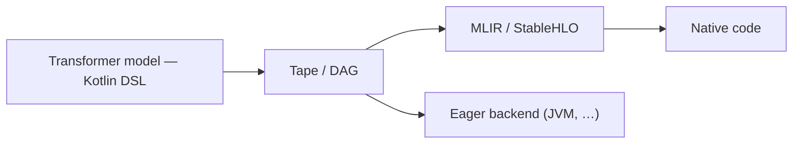

# SKaiNET-transformers

[](LICENCE)
[](https://central.sonatype.com/artifact/sk.ainet.transformers/skainet-transformers-agent)
[](https://deepwiki.com/SKaiNET-developers/SKaiNET-transformers)

Tranformers based LLM application layer on top of the [SKaiNET](https://github.com/SKaiNET-developers/SKaiNET) engine. Provides model-specific inference, agentic chat with tool calling, and a unified CLI for transformer-based models, all in Kotlin Multiplatform.

> [!WARNING]
> **Project status — early / experimental.**
> This repository is an **initial version**. Nothing here is stable, and there is
> **no support or status guarantee for any feature, model, or API**. Model
> coverage, tool calling, and the runtime APIs are all work in progress and may
> not work for a given model or model version — for example, tool calling can
> fail to trigger or parse even on a model that generates plain text correctly.
> The capabilities described below are **goals, not promises**. Treat everything
> as a preview and expect things to break.

## Start in 5 minutes

SKaiNET Transformers is Kotlin Multiplatform. The fastest way to verify it on
your machine is the unified `skainet-cli`:

1. Get a local **GGUF** model file (e.g. a small quantized TinyLlama or Qwen).
2. Run the CLI, pointing it at the model.
3. Confirm the prompt returns a generated answer.

```bash
./gradlew :llm-apps:skainet-cli:run \
  --args="-m /absolute/path/to/model.gguf 'The capital of France is'"
```

Expected result: the CLI auto-detects the model architecture, loads the model,
and streams a generated answer. See the
[getting-started tutorial](docs/modules/ROOT/pages/tutorials/getting-started.adoc)
for model setup notes.

Working in Java? SKaiNET Transformers ships first-class Java support — see the
[`kllama-java-sample`](llm-apps/kllama-java-sample/README.md) starter and the
[Java getting-started guide](docs/modules/ROOT/pages/tutorials/getting-started-java.adoc).

Use the version shown in this README as the source of truth for first-run snippets.

## Key features

> The list below describes the project's **intended** scope. Maturity varies
> widely per item and many paths are unverified — see the project-status note above.

- **Multi-model support (in progress).** Architecture code exists for Llama / Mistral, Qwen 2 / 3, Gemma 2 / 3 / 3n, Apertus (Swiss AI) and BERT. Llama is the most exercised path; the other families are at varying, often early, stages and are not all verified end-to-end.
- **Native CPU performance.** Auto-discovers SKaiNET's priority-100 FFM (Foreign Function & Memory) native kernel provider when present (4–6× faster Q4_K matmul, 1.5–1.8× faster FP32 SGEMM vs the priority-50 Panama Vector path; Linux x86_64 / macOS ARM64 / Windows x86_64 in the published JAR — no manual setup).
- **Tool calling (experimental).** Family-specific chat templates and tool-call parsers (Llama 3, Qwen, Gemma, Apertus, ChatML/Hermes) and a Java surface (`KLlamaJava`, `JavaTools.definition`, `JavaAgentLoop`) exist, but tool calling is **not reliable yet** — it may fail to trigger or parse even when plain generation works.
- **GGUF + SafeTensors loading.** Streaming reader for any model size; `NATIVE_OPTIMIZED` quant policy keeps weights in their packed SIMD-friendly form.
- **Kotlin Multiplatform.** JVM, Android, Kotlin/Native (Linux x64/ARM64, macOS ARM64, iOS arm64/sim arm64), JS, Wasm targets where applicable.

## Roadmap

### Architecture goal

SKaiNET Transformers follows the SKaiNET engine's core path: **a transformer model
is defined once in the Kotlin DSL, captured as a tape or DAG, and then either
compiled to native code or executed eagerly — without rewriting it.**

1. **Define** the model with the decoder DSL (`llamaNetwork()`, `apertusNetwork()`, …).
2. **Capture** it as a *tape* (traced execution) or a *DAG* (explicit graph).
3. **Run** it one of two ways:
   - **Compile** — lower the graph to MLIR / StableHLO and compile to **native** code.
   - **Eager** — execute directly on a backend. On the **JVM this is the primary, go-to path.**



Today every model family runs through the **eager JVM path**. The StableHLO /
native path is shared with the engine and not yet wired for full transformer
models.

### Where each architecture fits

Honest status — see the project-status note at the top of this README.

| Architecture | State |
|---|---|
| **Llama / Mistral** | Most exercised path — basic text generation works on the eager JVM path. |
| **Qwen 2 / 3** | DSL + loaders present; runs through the shared decoder path. Early; Qwen3 RoPE / QK-norm fixes landed in 0.23.2. |
| **Gemma 2 / 3 / 3n** | DSL + loaders present (Gemma 4 via the SafeTensors path); has the most test coverage, but not verified end-to-end. |
| **Apertus** | DSL + loaders present; declared end-to-end in 0.23.1, still early. |
| **BERT** | Encoder for embeddings only — no text generation, no tool calling. |
| **Voxtral** | TTS / voice; architecture code only — no runtime facade or CLI yet. |

### Near term

- Make the **eager JVM path reliable per family** — including tool calling —
  before extending scope.
- Verify each generative architecture end-to-end with smoke tests.
- Wire the **StableHLO / native compilation path** for full transformer models.
  As of 0.28.1 a full gemma3 graph exports to StableHLO and `iree-compile`s to a
  `vmfb` (`GemmaMlirDumpTest`); next is running the compiled module and extending
  the same path to the other families.

## Current release

The current release is **0.28.1** — version-aligned with **SKaiNET 0.28.1**.
Skips 0.26.x / 0.27.x: SKaiNET-transformers tracked the engine internally across
that window without a tagged release. The headline is that the engine's
**Kotlin DSL → StableHLO → IREE export path is now complete** — a full gemma3
graph traces and lowers to StableHLO that `iree-compile`s to a `vmfb`
(`GemmaMlirDumpTest` / `GemmaTraceTest` are green against 0.28.1). SKaiNET
0.28.0/0.28.1 fixed the remaining export bugs: result-type inference for
`reshape`/`matmul`/`concatenate` ([#673](https://github.com/SKaiNET-developers/SKaiNET/issues/673))
and `conv1d`/`gather`/pooling/`flatten` shapes plus the `reduce_window` emission
form ([#675](https://github.com/SKaiNET-developers/SKaiNET/issues/675)).

The recommended way to consume is via the BOM. It pins every published `skainet-transformers-*` artifact and re-exports the upstream `sk.ainet:skainet-bom`, so the engine-side `sk.ainet.core:skainet-*` artifacts get the matching version too — you only need to declare the BOM version in one place.

```kotlin
dependencies {
    implementation(platform("sk.ainet.transformers:skainet-transformers-bom:0.28.1"))

    // Versions resolved from the BOM:
    implementation("sk.ainet.transformers:skainet-transformers-core")
    implementation("sk.ainet.transformers:skainet-transformers-runtime-kllama") // or runtime-kgemma, inference-qwen, inference-apertus
    implementation("sk.ainet.transformers:skainet-transformers-agent")          // chat templates + tool calling
}
```

To opt in to the native FFM CPU provider (recommended for JVM consumers):

```kotlin
dependencies {
    implementation("sk.ainet.core:skainet-backend-cpu")        // priority-50 Panama Vector
    implementation("sk.ainet.core:skainet-backend-native-cpu") // priority-100 FFM (auto-discovered)
}
```

`KernelRegistry` picks the highest-priority available provider; on hosts where the native lib doesn't load (sandboxed JDKs, unsupported arches), it cleanly falls back to Panama with no functional regression.

## Project structure

| Module               | Purpose                                                                 |
| -------------------- | ----------------------------------------------------------------------- |
| `llm-api`            | Framework-neutral interfaces (`ChatModel`, `EmbeddingModel`, `ToolDefinition`) — Spring AI-shaped. |
| `llm-core`           | `OptimizedLLMRuntime`, `ModelRegistry`, `UnifiedModelLoader`, shared abstractions. |
| `llm-inference/<arch>` | Per-architecture network DSLs and weight loaders (`llama`, `gemma`, `qwen`, `apertus`, `bert`). |
| `llm-runtime/<arch>` | Per-architecture runtime facades (`kllama`, `kgemma`, `kqwen`, `kapertus`). |
| `llm-agent`          | Chat templates, tool-call parsers, agent loops; Java surface.           |
| `llm-apps`           | CLIs: `skainet-cli` (unified), `kllama-cli`, `kbert-cli`, plus `kllama-java-sample`. |
| `llm-test/llm-test-java` | JUnit 5 end-to-end tests for the Java surface (gated on `TINYLLAMA_MODEL_PATH`). |

## Getting started

### Prerequisites

- JDK 21 or higher
- Gradle 8.10+

### CLI: unified `skainet-cli`

```bash
# Plain generation
./gradlew :llm-apps:skainet-cli:shadowJar
java -jar llm-apps/skainet-cli/build/libs/skainet-all.jar \
  -m /path/to/model.gguf "The capital of France is"

# Tool-calling demo (calculator + file-listing tools auto-registered)
java -jar skainet-all.jar -m model.gguf --demo --template=llama3 "What is 17 * 23?"

# Interactive agent
java -jar skainet-all.jar -m model.gguf --agent --template=apertus
```

`--template` accepts `llama3`, `chatml`, `qwen`, `gemma`, `apertus` (auto-detected from GGUF metadata if omitted).

### Java consumers

```java
try (KLlamaSession session = KLlamaJava.loadGGUF(modelPath, /* systemPrompt */ null)) {
    JavaTool calc = new JavaTool() {
        @Override public ToolDefinition getDefinition() {
            return JavaTools.definition(
                "calculator", "Evaluate an arithmetic expression.",
                "{\"type\":\"object\",\"properties\":{\"expression\":{\"type\":\"string\"}},\"required\":[\"expression\"]}"
            );
        }
        @Override public String execute(Map<String, ?> args) { /* ... */ }
    };
    JavaAgentLoop agent = JavaAgentLoop.builder()
        .session(session).tool(calc).template("llama3").build();
    String response = agent.chat("What is 17 * 23?");
}
```

See `llm-test/llm-test-java/src/test/java/.../KLlamaJavaToolCallingTest.java` for a runnable reference.

## What's new in 0.28.1

- **Engine pin `skainet 0.27.0 → 0.28.1`.** Picks up the completed Kotlin DSL →
  StableHLO → IREE export path. Every shape-changing op now declares its inferred
  output type (`reshape`/`matmul`/`concatenate`, [#673](https://github.com/SKaiNET-developers/SKaiNET/issues/673);
  `conv1d`/`gather`/pooling/`flatten`, [#675](https://github.com/SKaiNET-developers/SKaiNET/issues/675)),
  and `reduce_window` is emitted in IREE's generic region form — so a full gemma3
  graph traced via `GemmaMlirDumpTest` lowers to StableHLO that `iree-compile`s to
  a `vmfb`. No transformers-side API changes; existing callers compile unchanged.
- Verified end-to-end: `:llm-inference:gemma:jvmTest` green against the published
  0.28.1 (`GemmaMlirDumpTest`, `GemmaTraceTest` pass).

## What's new in 0.25.0

- **`DTypePolicy` on every `*NetworkLoader.fromGguf` / `.fromSafeTensors`
  entry.** A sealed `DTypePolicy` type (`Any | Require | Prefer | OneOf`,
  upstream of SKaiNET 0.25.0) is now accepted on every loader companion in
  `LlamaNetworkLoader`, `QwenNetworkLoader`, `GemmaNetworkLoader`,
  `ApertusNetworkLoader`, and `VoxtralNetworkLoader`. The policy is
  validated eagerly via `sk.ainet.apps.llm.DTypePolicyValidation` —
  `Require(BF16)` rejects on GGUF paths (no KEEP_NATIVE GGUF yet),
  accepts on SafeTensors paths. Default `DTypePolicy.Any` keeps the
  existing adaptive behaviour; every existing caller compiles
  unchanged.
- **SafeTensors BF16 KEEP_NATIVE** in `DecoderSafeTensorsLoader`. With
  `Require(BF16)` (or `Prefer(BF16)` / `OneOf` containing BF16) the
  loader stops dequanting BF16 SafeTensors weights and instead wraps
  the packed 2-bytes-per-element buffer in `Bf16DenseTensorData`. The
  matmul dispatch in `DefaultCpuOpsJvm` detects `Bf16TensorData` at
  runtime and routes to the SIMD BF16 kernel — a BF16 checkpoint now
  stays near its on-disk footprint in RAM instead of ~2× FP32 inflation.
- **Catalog goes BOM-only.** Every `skainet-*` alias in
  `gradle/libs.versions.toml` is now coordinate-only (no `version.ref`).
  Versions come from the `sk.ainet:skainet-bom` platform constraint
  re-exported by `:llm-bom`, and every consumer module pulls in
  `implementation(project.dependencies.platform(project(":llm-bom")))`
  in each affected source set. Engine bumps are still a one-line edit
  at the top of the catalog, but every internal build now exercises
  the BOM end-to-end — a missing-from-BOM regression fails locally
  instead of leaking into a published artifact.
- **Three reference smoke tests with `@Tag("smoke-reference")`** —
  the smoke tier that pins the architectures we always want to run end-
  to-end: `Qwen3ReferenceSmokeTest` (Qwen3-1.7B Q8 GGUF; exercises the
  new 0.25.0 `Q8_0MatmulKernel` + Qwen's `RoPEMode.SPLIT_HALF` +
  QK-Norm), `Gemma4ReferenceSmokeTest` (Gemma-4 E2B SafeTensors;
  sliding-window attention + per-layer KV sharing), and
  `BertLeafReferenceSmokeTest` (MongoDB `mdbr-leaf-ir` SafeTensors via
  the Java `KBertJava` surface). Run with
  `./gradlew test -PsmokeReference -PincludeIntegration`. Each test
  self-skips via JUnit `Assumptions` when the model file isn't
  reachable through the standard `~/.lmstudio/models/` /
  `~/.cache/huggingface/hub/` / env-var fallback chain.

### Earlier in the 0.23.x line

**0.23.5** — `skainet-cli` reliability on JDKs without the
`jdk.incubator.vector` module: `--enable-preview --add-modules
jdk.incubator.vector` flags reach the generated launchers (previously
only `gradle :run`); detection of scalar-fallback CPU ops with auto
weight dequant to FP32; backend label printed after the real ops
probe so it can't disagree with the warning beside it.

**0.23.4** — BOM is now correct and self-maintaining: `:llm-inference:apertus`
and `:llm-inference:voxtral` were missing from the BOM's constraints and are now
covered, so consumers pulling them through the BOM get proper version alignment;
the constraint list is auto-discovered by a `buildSrc/` convention plugin. The
README and tutorial dependency snippets were also fixed to use the published
artifact IDs (`skainet-transformers-core` etc.) via the BOM pattern.

**0.23.3** — Prefill progress callback: `generateUntilStop` and
`AgentLoop` expose `(done, total)` progress during the autoregressive
prefill loop via a default-no-op `AgentListener.onPrefillProgress`
method, so UIs on CPU-only runtimes can show that work is happening
between round start and the first generated token.

**0.23.2** — `kllama-cli`, `kllama-native`, `kllama-wasm`, and
`KLlamaJava` swapped to the DSL path (`OptimizedLLMRuntime` +
`llamaNetwork()`); GPU stubs deleted; SentencePiece + GGUF tokenizers
unified through upstream `sk.ainet.io.tokenizer`; markdown-fenced Llama 3
JSON tool calls now parse correctly; Qwen3 NEOX RoPE pairing fix; QK-norm
RMSNorm-eps wiring fix.

**0.23.1** — Apertus end-to-end (routing through `OptimizedLLMRuntime` +
`apertusNetwork()`, chat template + tool calling, real-GGUF Q4_K
loading); Gemma 4 chat-model JVM facade with mmap-arena cleanup; multi-id
EOS / stop-token support in the chat layer; SentencePiece auto-detect in
`fromTokenizerJson`; LEAF + Llama 3 single-JVM smoke test;
`ServiceLoader` shadow-jar fix-up so the priority-100 native-cpu provider
is picked up post-merge.

See [`CHANGELOG.md`](CHANGELOG.md) for the full set of changes.

## Engine

This project uses [**SKaiNET**](https://github.com/SKaiNET-developers/SKaiNET) as its underlying execution engine — tensor ops, neural-network DSL, kernel SPI, GGUF / SafeTensors I/O.

## License

MIT — see [LICENCE](LICENCE).
