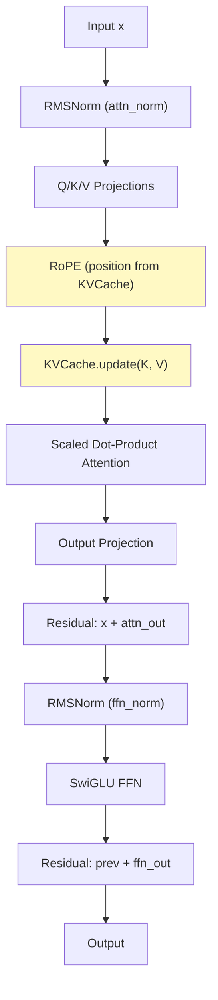
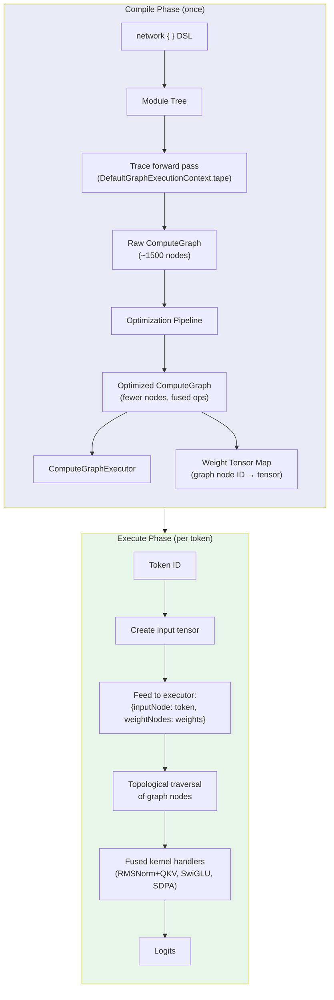
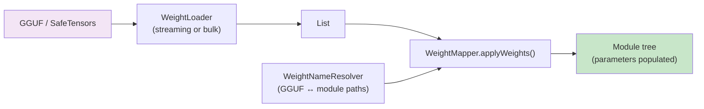
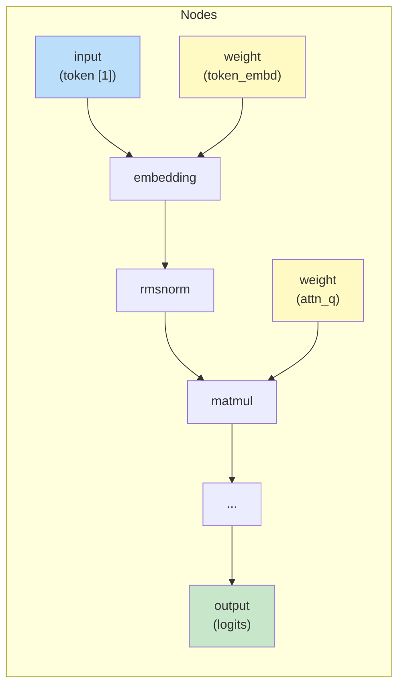
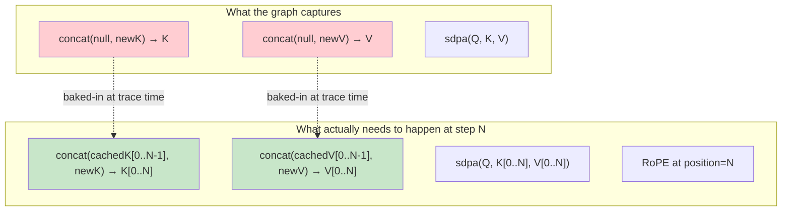
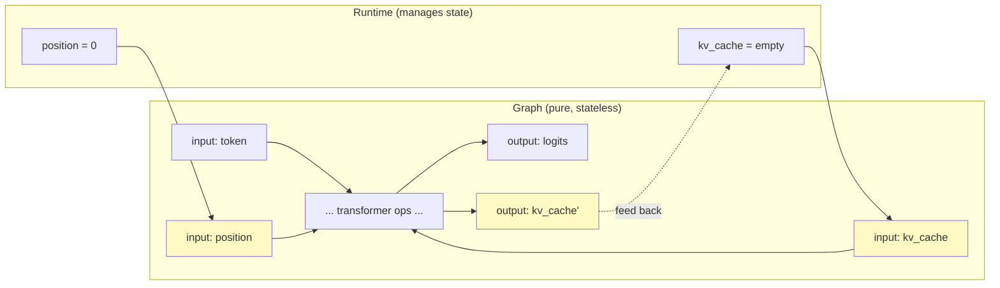
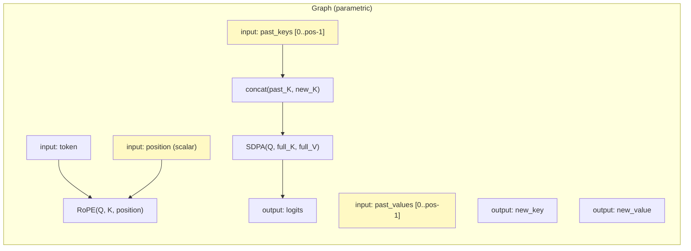
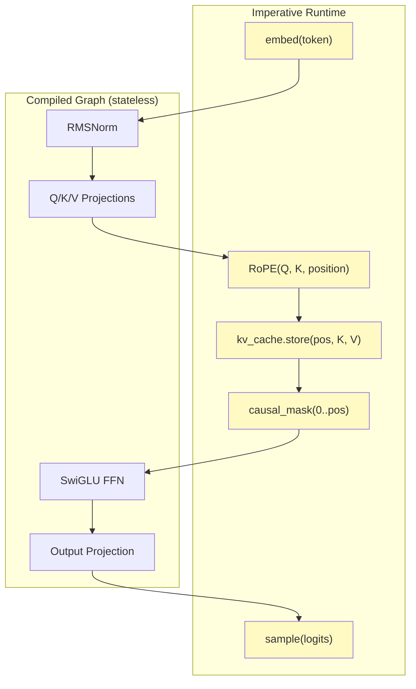

# SKaiNET-Transformers Architecture

## Overview

SKaiNET-Transformers is a Kotlin Multiplatform LLM inference engine built on top of the
[SKaiNET](https://github.com/AiNET-dev/SKaiNET) tensor computation framework. It supports
LLaMA, Gemma, Qwen, Apertus, and BERT model families across JVM, Android, iOS, macOS,
Linux, JS, and WASM targets.

The project is migrating from **hand-coded per-architecture runtimes** to a **unified,
DSL-driven runtime** (`OptimizedLLMRuntime`) that can execute models in two modes: direct
module-tree evaluation (for debugging) and compiled graph execution (for production).

---

## Module Structure

```
SKaiNET-transformers
├── llm-core/             Core abstractions: DecoderRuntime, OptimizedLLMRuntime,
│                         tokenizers, sampling, RoPE utilities
├── llm-agent/            High-level: ChatTemplate, ToolRegistry, AgentLoop
├── llm-inference/
│   ├── llama/            LLaMA network DSL + loader
│   ├── qwen/             Qwen network DSL + loader
│   ├── gemma/            Gemma network DSL + loader
│   ├── apertus/          Apertus network DSL + loader
│   └── bert/             BERT network DSL + loader
├── llm-runtime/
│   ├── kllama/           LLaMA platform runtime, attention backends, KV cache impls
│   ├── kgemma/           Gemma platform runtime
│   └── kapertus/         Apertus platform runtime
├── llm-apps/
│   ├── kllama-cli/       LLaMA CLI application
│   ├── kbert-cli/        BERT CLI application
│   └── kapertus-cli/     Apertus CLI application
└── llm-bom/              Bill of Materials
```

---

## The Two Execution Modes

### DIRECT Mode (Development / Debugging)

The `Module<T, V>` tree executes forward passes imperatively, like PyTorch eager mode.
Each module's `onForward(input, ctx)` is called in sequence. Stateful modules (KVCache)
mutate their internal state on each call.

```mermaid
flowchart LR
    Token["Token ID"] --> CT["createTokenTensor()"]
    CT --> MF["model.forward(tensor, ctx)"]
    MF --> EMB["Embedding"]
    EMB --> BLK0["Block 0"]
    BLK0 --> BLK1["Block 1"]
    BLK1 --> BLKN["...Block N"]
    BLKN --> NORM["Output RMSNorm"]
    NORM --> PROJ["Output Dense"]
    PROJ --> Logits["Logits [vocabSize]"]

    style MF fill:#e1f5fe
    style Logits fill:#c8e6c9
```



Each transformer block executes internally as:



### OPTIMIZED Mode (Production)

The module tree is traced once to capture all tensor operations as a DAG (Directed Acyclic
Graph). Optimization passes fuse and simplify the graph. A `ComputeGraphExecutor` replays
the graph on each forward call.



---

## From DSL to Graph: The Full Pipeline

### Step 1: Network Definition (DSL)

Models are defined declaratively using the SKaiNET `sequential { }` DSL:

```kotlin
fun <T : DType, V> llamaNetwork(metadata: LlamaModelMetadata): Module<T, V> {
    return sequential<T, V> {
        embedding(vocabSize, dim, id = "token_embd")
        for (layer in 0 until nLayers) {
            stage("blk.$layer") {
                rmsNorm(dim, eps, id = "attn_norm")
                multiHeadAttention(dim, nHeads, nKVHeads, causal = true) {
                    rope(headDim, seqLen)
                    kvCache(seqLen, nKVHeads, headDim)
                }
                residual()
                rmsNorm(dim, eps, id = "ffn_norm")
                swiGluFFN(dim, ffnDim, id = "ffn")
                residual()
            }
        }
        rmsNorm(dim, eps, id = "output_norm")
        dense(vocabSize, id = "output")
    }
}
```

This produces a `Module<T, V>` tree — a nested hierarchy of composable neural network
building blocks. The same definition is used for both DIRECT and OPTIMIZED modes.

### Step 2: Weight Loading

Weights from GGUF or SafeTensors files are mapped onto the module tree:



`WeightMapper` supports path-based and shape-based matching with a `WeightNameResolver`
to bridge GGUF tensor names (e.g., `blk.0.attn_q.weight`) to module parameter paths.

### Step 3: Tracing (OPTIMIZED mode only)

A recording `ExecutionContext` captures every tensor operation during a forward pass:

```kotlin
val tapingCtx = DefaultGraphExecutionContext.tape(baseOps = ctx.ops)
tapingCtx.startRecording()
model.forward(dummyInput, tapingCtx)  // records all ops
val tape = tapingCtx.stopRecording()
```

The tape stores:
- **Operation records**: each `matmul`, `add`, `rmsnorm`, etc., with input/output tensor IDs
- **Tensor references**: maps tensor IDs → actual tensor objects (via `TraceSession`)
- **Edge wiring**: which operation outputs feed into which operation inputs

### Step 4: Graph Construction

The tape is converted to a `ComputeGraph` — a DAG of typed nodes and edges:



Key choices:
- `embedConstants = false` — weight arrays are **not** embedded in graph nodes (would OOM
  for large models). Instead, they're resolved at execution time from the `TraceSession`.
- `synthesizeExternalInputs = true` — creates `input`/`weight` placeholder nodes for
  unresolved tensor references.

### Step 5: Optimization Passes

The `GraphOptimizationPipeline` runs 5 passes (up to 2 iterations):

| Pass | What it does | Example |
|------|-------------|---------|
| **TransposeEliminationPass** | Removes redundant transpose pairs | `transpose(matmul(transpose(A), B))` → fused |
| **SharedWeightDeduplicationPass** | Merges duplicate weight nodes | Tied embeddings share one node |
| **LLMFusionPass** | Fuses LLM-specific patterns | RMSNorm + QKV → `rmsnorm_qkv_fused` |
| **OperationFusionPass** | Fuses adjacent general ops | `matmul + add` → `linear_fused` |
| **DeadCodeEliminationPass** | Removes unreachable nodes | Orphaned branches pruned |

**LLM-specific fused kernels:**

```
rmsnorm_qkv_fused:      RMSNorm → Q/K/V projections (1 kernel, 4 matmuls saved)
rmsnorm_ffn_silu_fused:  RMSNorm → gate/up → SiLU → down (1 kernel, full FFN)
sdpa_fused:              Q·Kᵀ/√d → softmax → ·V (single kernel, no intermediate)
```

### Step 6: Execution

`ComputeGraphExecutor` replays the graph in topological order:

1. Resolve `input` nodes from the dynamic input map (token tensor)
2. Resolve `weight` nodes from the static `weightTensorMap`
3. For each operation node: look up handler by `operationName`, invoke with resolved inputs
4. Return the final output (logits)

Fused op handlers are registered via `LLMFusedOpHandlers.registerAll()`. Platform-specific
backends (Metal, CUDA) can override CPU fallbacks.

---

## The State Management Problem

### What Makes LLM Inference Stateful

Autoregressive LLM decoding has three pieces of **mutable state** that change every step:

1. **Position counter** — which token index we're at (for RoPE)
2. **KV Cache** — accumulated key/value tensors from all past positions
3. **Causal mask shape** — attention window grows by 1 each step

### How the Old Runtime Handles State

The old `LlamaRuntime` passes state **explicitly through the call stack**:

```kotlin
// Position is a parameter — module never needs to "find" it
val attnOut = attentionBackend.attention(q, k, v, layerIdx, position)
//                                                          ^^^^^^^^

// Inside CpuAttentionBackend:
fun attention(q, k, v, layerIdx, position) {
    applyRopeRotation(q, position)           // RoPE at exact position
    cache.store(layerIdx, position, k, v)    // Store at exact slot
    for (t in 0..position) { ... }           // Causal: attend 0..pos
}
```

The KV cache is a **flat pre-allocated array** indexed by `[layer, position, head, dim]`.
Position is always known because it's passed in.

### How the New Runtime Handles State

The DSL module tree uses **implicit state** — modules own their mutable fields:

```kotlin
// MultiHeadAttention.onForward():
val position = kvCache?.position ?: 0      // Query cache for position
q = rope.forward(q, position, ctx)         // RoPE with inferred position
val (fullK, fullV) = kvCache.update(k, v)  // Concat-based cache growth
```

`KVCache` is a `Module` with internal mutable state:

```kotlin
class KVCache<T, V> : Module<T, V>() {
    private var cachedKeys: Tensor<T, V>? = null    // grows via concat
    private var cachedValues: Tensor<T, V>? = null
    private var cachePosition: Int = 0              // tracks position

    fun update(newK, newV, ctx): Pair<Tensor, Tensor> {
        fullK = concat(cachedKeys, newK)  // append along seq dim
        fullV = concat(cachedValues, newV)
        cachedKeys = fullK
        cachedValues = fullV
        cachePosition += newK.seqLen
        return fullK to fullV
    }
}
```

**In DIRECT mode this works** — modules are called imperatively, mutable state advances
naturally across forward calls.

**In OPTIMIZED mode this is the core problem** — the graph captures the tensor operations
from **one** tracing pass (at position 0, empty cache). Replaying that graph doesn't
re-execute the Kotlin code that mutates `KVCache` fields.

### The State/Graph Incompatibility



The traced graph has `concat(null, K)` (empty cache) hard-wired. It doesn't know about
the growing cache or advancing position.

---

## Approaches to Graph-Based Stateful Inference

There are three main strategies for handling stateful LLM inference in a graph framework.

### Approach 1: Graph with Explicit State I/O

The graph is a **pure function**: `(token, position, kv_cache_in) → (logits, kv_cache_out)`.
All mutable state is externalized as graph inputs and outputs. The runtime manages state
between calls.



**Used by:** ONNX Runtime, TensorRT-LLM, llama.cpp (GGML graphs), Core ML

**Pros:**
- Graph is fully optimizable (no opaque state)
- Graph is serializable and portable
- Cache memory layout is controlled by the runtime (can use paged/ring buffers)

**Cons:**
- Graph I/O includes large KV tensors (memory copies unless zero-copy)
- Graph must handle variable sequence length in KV cache dimension
- More complex graph construction (state threading)

### Approach 2: Parametric Graph

The graph is **position-agnostic**: it accepts position as a parameter and computes
RoPE dynamically. The KV cache is also a parameter, but the graph doesn't grow it —
the runtime grows it and feeds the full cache each time.



**Used by:** vLLM, TGI (HuggingFace Text Generation Inference), ExecuTorch

**Pros:**
- Single compiled graph works for all positions
- RoPE and attention are fully in-graph (optimizable)
- Runtime only manages cache concatenation

**Cons:**
- Still requires passing full KV cache as input (same as Approach 1)
- Graph must support dynamic shapes (variable cache length)

### Approach 3: Hybrid (Graph + Imperative State)

The graph handles **pure compute** (embeddings, linear layers, norms, FFN, activations).
**Stateful components** (KV cache, RoPE, causal masking) live in imperative code outside
the graph. The graph is invoked as a subroutine within the imperative loop.



**Used by:** PyTorch compile (torch.compile), JAX (jit with static_argnums)

**Pros:**
- Easiest to implement incrementally (graph handles what it can, rest stays imperative)
- No variable-shape graph inputs needed
- State management code is normal Kotlin (debuggable)
- Fused kernels still apply to the compute-heavy parts (QKV, FFN)

**Cons:**
- Attention can't be fused end-to-end (SDPA split across graph boundary)
- More kernel launch overhead (multiple small graphs vs one large one)
- Optimization scope is limited to each graph segment

### Comparison Matrix

| Aspect | Explicit I/O | Parametric | Hybrid |
|--------|-------------|-----------|--------|
| **Graph purity** | Fully pure | Fully pure | Partially pure |
| **Optimization scope** | Whole model | Whole model | Per-segment |
| **Implementation effort** | High | High | Low (incremental) |
| **Dynamic shapes** | Required | Required | Not needed |
| **State debuggability** | Hard (in graph) | Hard (in graph) | Easy (Kotlin code) |
| **SDPA fusion** | Yes | Yes | Partial |
| **KV cache control** | Runtime-managed | Runtime-managed | Runtime-managed |
| **Portable/serializable** | Yes | Yes | No (tied to runtime) |

### Recommendation for SKaiNET-Transformers

The **Hybrid approach** is the natural fit for the current architecture because:

1. The module tree already separates compute (RMSNorm, Dense, SwiGLU) from state (KVCache)
2. The existing optimization passes (LLMFusionPass) fuse the compute-heavy parts
3. KVCache and RoPE can stay as imperative Kotlin modules
4. No changes needed to the graph framework (no dynamic shapes)
5. Incremental: start with the compute segments, expand scope later

The **Parametric approach** is the long-term target if the graph framework gains dynamic
shape support — it enables full-model optimization including attention fusion.

---

## Current Bugs

### ~~DIRECT Mode: Logits Nearly Constant Across Tokens~~ (FIXED)

**Root cause:** The `MLP` sequential container (from skainet) chains modules via
`forward()` but never sets `ResidualAdd.savedInput`. Skip connections were silently
no-ops — `ResidualAdd.onForward()` returned `input` unchanged when `savedInput` was null.
Without residuals, signals degraded through deep networks, producing near-constant output.

**Fix:** Introduced `TransformerBlock` (in `llm-core`) — a sequential module that
understands `ResidualAdd` and sets `savedInput` to the tensor at each residual block
boundary before executing the block. All model definitions (Llama, Apertus, BERT) now
use `TransformerBlock` instead of `MLP` for transformer layers.

**Verification** (from `StateManagementTest`):
```
DIRECT multi-step divergence from step 0:
  step 1: maxDiff=3.19, mismatch=100%  (was 0.015 before fix)
  step 2: maxDiff=0.87, mismatch=100%
  step 3: maxDiff=2.95, mismatch=100%
```

### OPTIMIZED Mode: Position Not Advancing

**Symptom:** First token matches DIRECT mode closely (maxDiff=0.0003), but subsequent
tokens diverge completely (maxDiff=12.8, 100% mismatch).

**Root cause:** The traced graph captures operations at position 0 with empty KV cache.
On replay, the graph re-executes those same operations without advancing position or
growing the cache. This is the fundamental state/graph incompatibility described above.

**Fix required:** Implement one of the three approaches (Explicit I/O, Parametric, or
Hybrid) to properly handle stateful inference in the graph execution path.

---

## Minimal Reproducer: `StateManagementTest`

A self-contained test in `llm-inference/llama/src/jvmTest/.../StateManagementTest.kt`
demonstrates both issues using a tiny model (dim=8, 1 layer, vocab=16) with deterministic
weights. No external model file needed. Run with:

```bash
./gradlew :llm-inference:llama:jvmTest --tests "*.StateManagementTest"
```

### Results (7 tests, 5 pass, 2 skipped)

| Test | Result | Key Metric |
|------|--------|-----------|
| DIRECT - same token at different positions (V has no RoPE) | PASS | maxDiff=7.2e-7 |
| DIRECT - different tokens at successive positions | PASS | maxDiff=3.19 |
| DIRECT - different tokens produce very different logits | PASS | maxDiff=3.42 |
| DIRECT - multi-step divergence from step 0 | PASS | step1 diff=3.19 |
| DIRECT - reset restores initial state | PASS | maxDiff=0.0 |
| OPTIMIZED - first token should match DIRECT | SKIP | graph weight resolution issue |
| OPTIMIZED - second token should match DIRECT | SKIP | graph weight resolution issue |

### What the Numbers Tell Us

**DIRECT mode (all pass):**
- Residual connections work correctly. Different tokens produce large output differences
  (maxDiff=3.42), and multi-step context accumulation via KV cache shows 100% element
  mismatch from step 0 (as expected).
- Same token at different positions produces near-identical logits (maxDiff=7.2e-7).
  This is mathematically correct: RoPE rotates Q and K but not V, so when all tokens
  are identical, V vectors in the KV cache are identical and attention output is
  position-independent.

**OPTIMIZED mode (skipped):**
- Weight resolution and state management issues remain. See Approach 3 (Hybrid) above.
