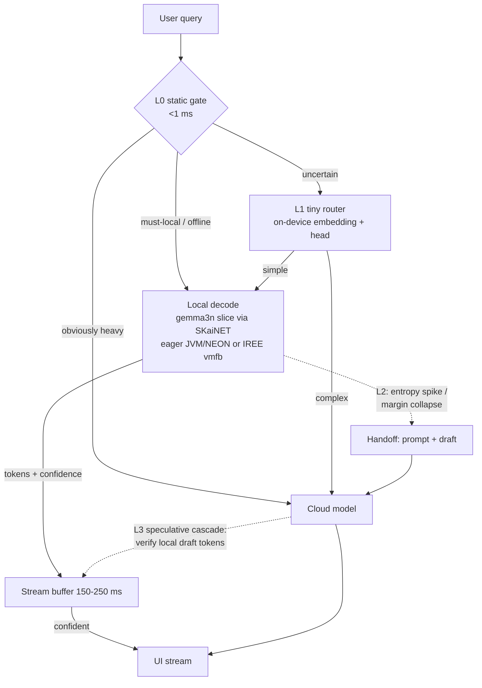

# MatFormer & Hybrid On-Device AI — analysis and architecture proposal

Status: **pre-PRD design note** (2026-09-02). Scope: (1) what MatFormer is and how far our
gemma3n implementation already carries it, (2) a clean SKaiNET-native design for elastic
MatFormer inference, (3) an architecture for **hybrid on-device/cloud serving** — simple
queries answered locally and instantly, complex ones escalated to the cloud, with the
routing decision fast enough that the user never perceives a seam.

---

## 1. MatFormer — what it actually is

**MatFormer (Matryoshka Transformer)** trains one transformer so that *prefixes of every
FFN's hidden dimension are themselves complete, usable models*. During training, each
layer's FFN is optimized at g nested widths (e.g. 4096 ⊂ 8192 ⊂ 12288 ⊂ 16384); the loss
is the average over the nested submodels. Result: one weight file, a *spectrum* of
deployable models.

- Paper: Devvrit, Kudugunta, et al., **"MatFormer: Nested Transformer for Elastic
  Inference"**, [arXiv:2310.07707](https://arxiv.org/abs/2310.07707).
- Lineage: Kusupati et al., **"Matryoshka Representation Learning"**,
  [arXiv:2205.13147](https://arxiv.org/abs/2205.13147) (same nesting idea for embeddings).
- Production instance: **Gemma 3n**
  ([developer guide](https://developers.googleblog.com/en/introducing-gemma-3n-developer-guide/)):
  E4B (8B raw) co-trains a nested **E2B** (5B raw) submodel. **Mix-n-Match** slices
  intermediate sizes by choosing each layer's FFN width in [8192, 16384] (and optionally
  skipping layers). Google ships a
  [MatFormer Lab colab](https://ai.google.dev/gemma/docs/gemma-3n#matformer) for picking
  slice configs benchmarked on MMLU.
- Reference implementations: HF `transformers` `Gemma3nTextMLP` (per-layer
  `intermediate_size[layer_idx]` — the sliced widths arrive as plain config), llama.cpp
  `gemma3n` (same), Google AI Edge / MediaPipe LLM Inference for the on-device runtime.

**Key operational insight:** at inference time MatFormer is *not* exotic. A slice is just
per-layer FFN widths + (optionally) fewer layers, reading **prefix sub-ranges of the same
weight tensors**. All elasticity lives in the loader/config, not in new math.

## 2. Where our implementation stands (post #377 DSL lane)

Already in place, verified token-for-token vs llama.cpp:

- `Gemma3nModelMetadata.feedForwardLengths: List<Int>` — per-layer FFN widths parsed from
  the GGUF (`feed_forward_length` per-layer array).
- `gemma3nNetwork()` builds **each layer's FFN width independently** — a Mix-n-Match
  config is *already representable*; only E2B's uniform 8192 has been exercised.
- PLE, AltUp, Laurel, sparsity, shared KV as DSL modules; packed/MAPPED loading;
  StableHLO export (`exportGemma3n`) with PLE-as-host-input for the mobile path.

Missing for real MatFormer elasticity:

1. **Slice-aware weight views.** An E4B file with an E2B (or custom) slice config must
   bind `ffn_gate/up[0:width]` and `ffn_down[:, 0:width]` — prefix *views* of the stored
   tensors, no copies. SKaiNET tensors already support `narrow`; the loader needs a
   "slice plan" hook.
2. **Slice config surface.** `Gemma3nSliceConfig(perLayerFfn: List<Int>, skipLayers:
   Set<Int>)`, loadable from a JSON sidecar (the MatFormer Lab output format).
3. **Elastic runtime switch.** Two `Module` builds (fast/full) over the *same* weight
   map — memory cost is the weight file once (mmap) + two small module trees; switching
   is picking which module the runtime steps. On the compiled path: one vmfb per slice
   (IREE graphs are static), same `.irpa` parameter archive shared between them.

### Clean SKaiNET design (fits both execution philosophies)

- **Eager (DSL → modules):** `gemma3nNetwork(metadata, slice)` where `slice` rewrites
  `feedForwardLengths` and the layer list; `Gemma3nWeightLoader` gains
  `sliceView(tensor, layer)` returning narrow views. One weight map, N module trees.
- **Compiled (DSL → DAG → StableHLO):** trace each slice once; emit
  `gemma3n-e2b.vmfb`, `gemma3n-e3b.vmfb`, … all referencing **one parameter scope** —
  IREE loads params by name, and prefix-sliced tensors export as their own named params
  (only the sliced FFNs duplicate bytes in the archive; everything else is shared).
  Alternative (later): emit the full-width graph and pass runtime width as a dynamic dim
  — rejected for now; IREE static shapes are the proven lane.

## 3. Hybrid on-device / cloud serving

### The product requirement

Simple queries ("set a timer", "summarize this note", quick factual Q&A) answer
**offline, instantly, privately**. Complex ones (long reasoning, tool orchestration,
fresh knowledge) go to a **cloud model**. The user sees ONE assistant: no mode switch, no
spinner-then-restart. That forces the routing decision to be either (a) made in ≲50 ms,
or (b) made *behind* an already-streaming local answer.

### Design principle: draft-first, escalate-on-evidence

Never block on the router. **The local model always starts.** Routing signals accumulate
in three layers, cheapest first:

| Layer | Signal | Cost | Acts |
|---|---|---|---|
| L0 | static features: prompt length, tool availability offline, connectivity, battery/thermal, PII policy ("must stay local") | < 1 ms | pre-pick lane; hard-pin local for private content |
| L1 | tiny router: embedding of the prompt → complexity classifier (MRL-truncated embedding + logistic head, or a distilled BERT — we have `bertNetwork()` + LEAF/BGE embedders on-device) | 5–20 ms | route obvious cases before first token |
| L2 | local model's own uncertainty while drafting: first-k token logit margin / entropy, `<unsure>` self-probe, draft perplexity trend | free (by-product of decoding) | escalate mid-stream |
| L3 | cloud verification (optional, speculative-cascade mode): cloud model verifies/extends the local draft à la speculative decoding across tiers | network RTT | quality backstop |

The seam is hidden by **stream discipline**: hold the first ~150–250 ms of local tokens
in a presentation buffer. If L0–L2 escalate within the buffer window, the user never saw
the local draft; if the local answer is already flowing and L2 fires, the handoff sends
`(prompt, draft-so-far)` to the cloud with an instruction to continue/repair — visible at
worst as a brief pause, never as a restart.

### Data flow

### Where MatFormer earns its keep here

Elastic width is the **third axis of the routing decision**: instead of binary
local/cloud, the device picks E2B-width for battery/latency, a wider Mix-n-Match slice
when plugged in or when L1 says "medium difficulty" — same weights, no extra download.
Google's guide names exactly this ("elastic execution … dynamically switch E4B/E2B based
on the task and device load") as a future capability; the slice-view design in §2 is our
path to shipping it.

### SKaiNET implementation sketch

- **`HybridSession`** (new, `llm-agent`): wraps two `InferenceRuntime`s — local
  (`OptimizedLLMRuntime` over gemma3n) and remote (an `InferenceRuntime` adapter over an
  HTTP streaming API). Owns the L0–L2 state machine and the stream buffer. `ChatSession`
  API stays the user surface, so tool calling and templates work in both lanes.
- **Router**: `bertNetwork()`-based embedder (already verified vs sentence-transformers)
  + a trained head; ships as a tiny side model. L2 signals read from the logits SKaiNET
  already returns each step (`sampleFromTensor` exposes the tensor — margin/entropy is
  a 10-line addition).
- **Handoff protocol**: cloud request carries `{messages, localDraft, draftLogprobs?}`;
  the cloud either continues (prefix-cache friendly) or rewrites. For L3, the same
  payload makes the cloud a *verifier* (speculative cascade).
- **On Android**: local lane = IREE vmfb (compiled slice) or eager NEON; router+buffer
  logic is common KMP code shared with iOS/desktop.

### Papers / prior art to anchor the PRD

- Routing: **RouteLLM** (Ong et al., [arXiv:2406.18665](https://arxiv.org/abs/2406.18665);
  [github.com/lm-sys/RouteLLM](https://github.com/lm-sys/RouteLLM)) — trained binary
  routers, 2×+ cost cuts at matched quality. **Hybrid LLM** (Ding et al., ICLR 2024,
  [arXiv:2404.14618](https://arxiv.org/abs/2404.14618)) — quality-aware small/large
  routing. **FrugalGPT** (Chen et al., [arXiv:2305.05176](https://arxiv.org/abs/2305.05176)) —
  cascades with stop-signals.
- Draft/verify across tiers: **speculative decoding** (Leviathan et al.,
  [arXiv:2211.17192](https://arxiv.org/abs/2211.17192)); **speculative cascades**
  (Narasimhan et al., [arXiv:2405.19261](https://arxiv.org/abs/2405.19261)) — the formal
  blend of cascades + speculative execution we call L3.
- Confidence signals: token-entropy/margin early-exit literature (e.g. CALM, Schuster et
  al., [arXiv:2207.07061](https://arxiv.org/abs/2207.07061)).
- Elasticity: MatFormer + MRL above; Gemma 3n guide for the production framing.
- Product precedent: Apple Intelligence's on-device/Private-Cloud-Compute split — the UX
  bar for "seamless" (no user-visible routing).

### Open questions for the PRD

1. Escalation budget: max acceptable silent hold (proposal: 250 ms) and mid-stream
   handoff UX (pause vs. visible "thinking harder").
2. Router training data: which task taxonomy, and do we log (opt-in) local drafts +
   outcomes to train it.
3. Privacy contract: which content classes are hard-pinned local (L0) regardless of
   quality cost.
4. Cloud protocol: continue-from-draft vs. fresh generation; prefix-cache assumptions.
5. MatFormer slice policy: fixed two slices (fast/full) first, or continuous
   Mix-n-Match from device telemetry.
