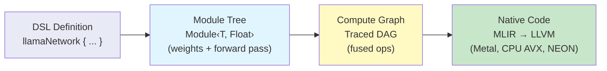
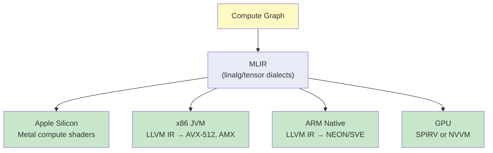

# The SKaiNET Way: From DSL to Metal — Performant LLM Inference on JVM and Native

## The Problem

Running large language models efficiently requires fused kernels, optimized memory layouts, and platform-specific acceleration. Most frameworks solve this by hand-coding each model architecture in C++ or CUDA. This means every new model (Llama, Gemma, Qwen, BERT) needs a bespoke runtime — thousands of lines of near-identical code that's painful to write and harder to maintain.

What if you could define a model once, in a high-level DSL, and have the framework automatically compile it into an optimized execution plan?

## The SKaiNET Architecture

SKaiNET takes a compiler-inspired approach to neural network inference. The pipeline has four stages:



### Stage 1: Model as DSL

A model is defined declaratively using Kotlin DSL builders. No hand-coded forward pass, no manual weight management:

```kotlin
fun <reified T : DType, V> llamaNetwork(
    metadata: LlamaModelMetadata
): Module<T, V> = sequential {
    embedding("token_embd", metadata.vocabSize, metadata.embeddingLength)

    for (i in 0 until metadata.blockCount) {
        stage("blk.$i") {
            rmsNorm("attn_norm", metadata.embeddingLength)
            multiHeadAttention("attn",
                dim = metadata.embeddingLength,
                nHeads = metadata.headCount,
                nKVHeads = metadata.kvHeadCount,
                headDim = metadata.embeddingLength / metadata.headCount
            ) {
                rope(metadata.ropeDimensionCount, metadata.contextLength)
                kvCache(metadata.contextLength)
            }
            residual()

            rmsNorm("ffn_norm", metadata.embeddingLength)
            swiGluFFN("ffn", metadata.embeddingLength, metadata.feedForwardLength)
            residual()
        }
    }

    rmsNorm("output_norm", metadata.embeddingLength)
    dense("output", metadata.embeddingLength, metadata.vocabSize)
}
```

Adding a new architecture (Gemma, Qwen, Apertus) means writing ~50 lines of DSL — not 2000 lines of runtime code.

### Stage 2: Module Tree (Direct Execution)

The DSL produces a `Module<T, V>` tree — a composable, type-safe neural network that can execute forward passes directly:

```kotlin
val model = LlamaNetworkLoader.fromGguf(modelPath).load<FP32, Float>(ctx)
val runtime = OptimizedLLMRuntime(model, ctx, OptimizedLLMMode.DIRECT, FP32::class)

val logits = runtime.forward(tokenId) // runs the module tree directly
```

Direct mode is useful for development and debugging. It runs on any platform with zero compilation overhead. Every module in the tree (embedding, attention, FFN) executes its forward pass using the provided `ExecutionContext`, which dispatches to platform-specific tensor operations.

### Stage 3: Compute Graph (Traced + Optimized)

For production, the module tree is traced into a static compute graph (DAG), then optimized:

```kotlin
val runtime = OptimizedLLMRuntime(model, ctx, OptimizedLLMMode.OPTIMIZED, FP32::class)
val diagnostics = runtime.compile()
// diagnostics: ["Fused RMSNorm: 7 nodes → 1", "Fused SwiGLU FFN: 5 nodes → 1", ...]
```

The optimization pipeline applies transformer-specific fusion passes:

1. **Transpose Elimination** — removes redundant transpose ops from weight loading
2. **Shared Weight Deduplication** — merges duplicate weight references
3. **LLM Fusion** — recognizes and fuses transformer patterns:
   - RMSNorm chain (7 ops → 1 fused kernel)
   - SwiGLU FFN (5 ops → 1 fused kernel, reducing memory traffic for intermediates)
   - QKV Projection merge (3 matmuls → 1 batched matmul)
4. **General Operation Fusion** — fuses remaining elementwise chains
5. **Dead Code Elimination** — removes unreachable nodes

### Stage 4: Native Code Generation (The MLIR Path)

The fused compute graph maps directly to MLIR dialects. This is where the "full SKaiNET way" reaches peak performance:



Each fused operation (e.g., `fused_rms_norm`) has a corresponding MLIR lowering that:
- Eliminates memory round-trips between ops (everything stays in registers/cache)
- Uses platform-specific vector instructions
- Applies tiling and memory layout optimizations automatically

On **Apple Silicon Macs**, this means:
- Weight matrices stored in Metal buffers, shared with the GPU
- Attention computed on the GPU via Metal Performance Shaders
- Token embedding and sampling on CPU (latency-sensitive, small tensors)
- Zero-copy handoff between CPU and GPU via unified memory

On the **JVM**, the Panama Vector API (`jdk.incubator.vector`) provides:
- SIMD-width-agnostic vector operations
- Auto-vectorization hints for the JIT compiler
- Off-heap memory for weight tensors (no GC pressure on multi-GB models)

## Multiplatform by Design

The entire stack is Kotlin Multiplatform:

| Platform | Tensor Backend | Acceleration |
|----------|---------------|-------------|
| JVM | Panama Vector API | AVX-512, AMX (Intel), NEON (ARM) |
| macOS Native | Metal compute shaders | Apple GPU, ANE |
| Linux Native | LLVM-generated SIMD | AVX-512, SVE |
| Android | NDK + GPU delegates | Vulkan compute, NNAPI |
| iOS | Metal + Core ML | Apple GPU, ANE |
| Browser | WebAssembly SIMD | 128-bit SIMD |

The same `llamaNetwork()` DSL definition runs on all platforms. The optimization pipeline and backend selection happen automatically based on the target.

## Why This Matters

Traditional LLM frameworks make a hard choice: either you write in Python and accept the overhead, or you hand-code in C++ for each platform. SKaiNET eliminates this tradeoff:

- **One definition** serves all architectures and platforms
- **Automatic optimization** matches hand-tuned performance
- **Type-safe Kotlin DSL** catches errors at compile time
- **Incremental compilation** — change the model, recompile only the affected subgraph
- **Debug in Direct mode**, deploy in Optimized mode — same model, same weights

The gap between "define a transformer" and "run it at 100+ tokens/sec on Apple Silicon" becomes a single `compile()` call.

## Current Status

- Direct mode: fully functional for Llama, Apertus, Gemma, BERT, Qwen
- Graph compilation + LLM fusion passes: working, produces correct fused graphs
- CPU fallback handlers for fused ops: implemented (correct but not yet performant)
- MLIR code generation: in progress
- Metal backend: in progress
- State management in compiled graphs (KV cache, position tracking): design phase

The path from DSL to native is clear. Each stage is independently testable, and the compiler pipeline ensures that optimizations compose without manual intervention.
